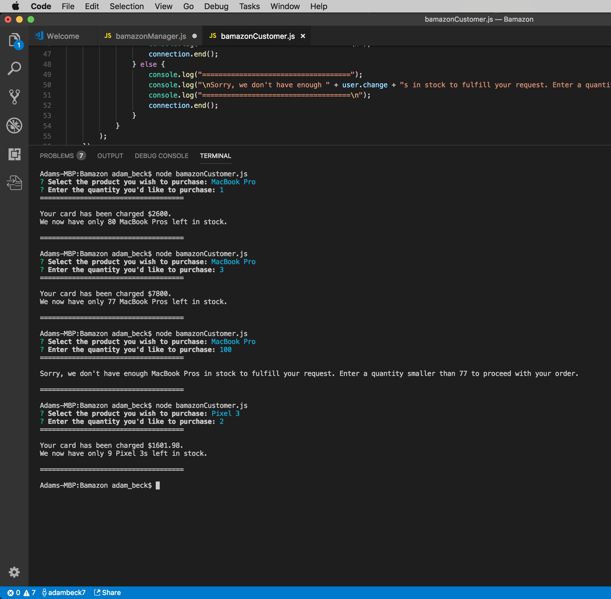
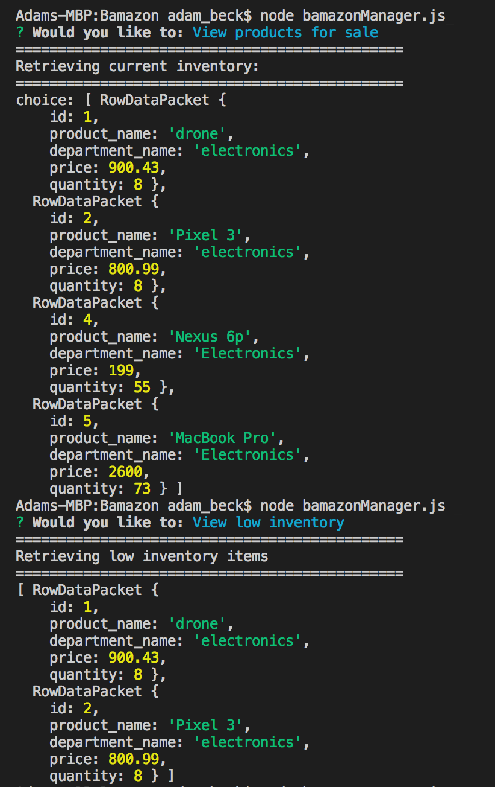
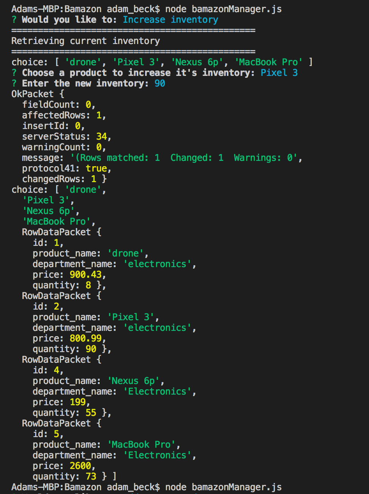
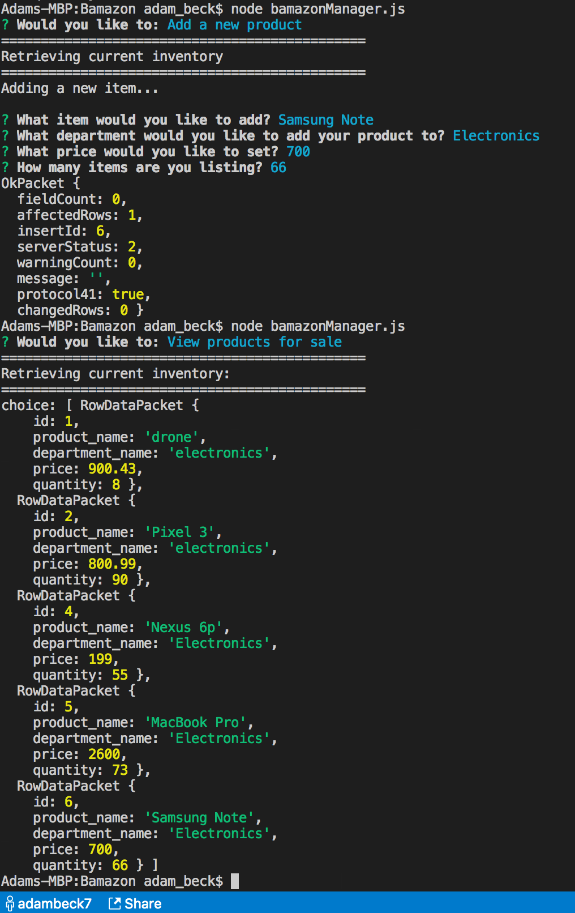

# node-mysql-store

Here's an exampe of what you can do as a 'customer'. Inquirer will list our available products and you can choose one to purchase. It will then ask how many you would like to purchase. If that quantity is available a messsage prints out the total cost of your purchase and the remaining inventory. If there is not enough quantity to fulfill your request it prints a message letting you know what our current inventory is. 

[Customer demo](https://vimeo.com/283343236)

[Manager demo](https://vimeo.com/283343176)

If you run the Manager file you're able to view the available inventory as well as just items classfied as 'low inventory':

change the available inventory: 

and add new products:

